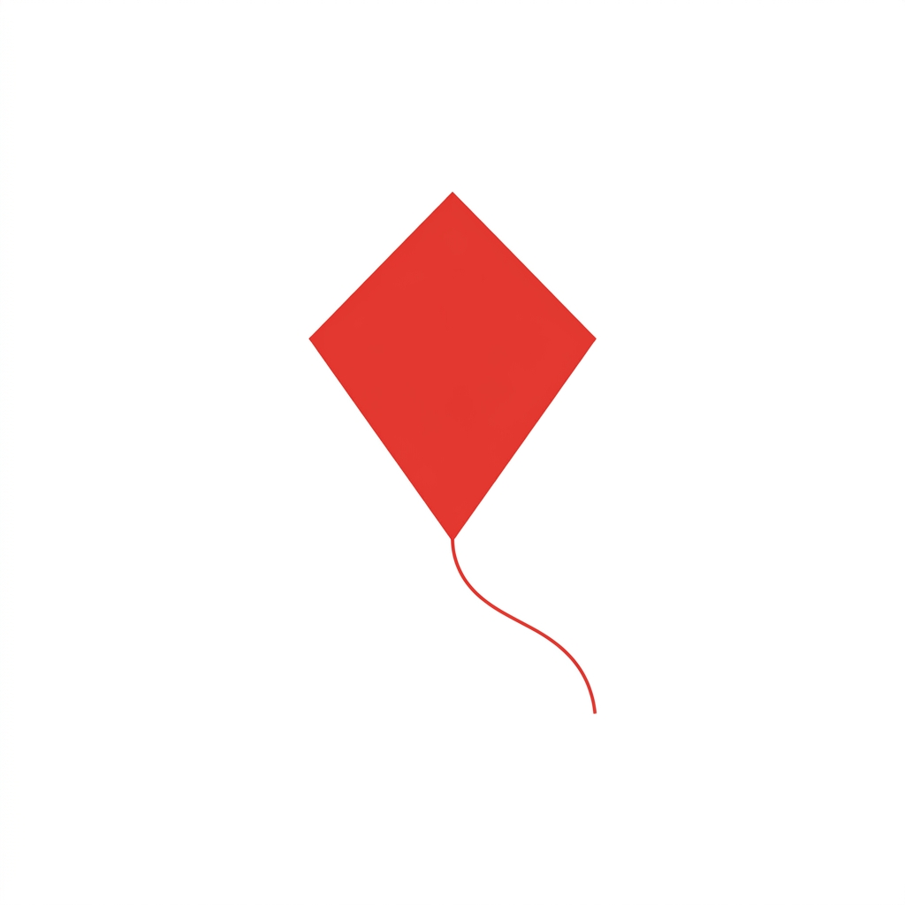

# 🪁 Kite Windows

<p align="center">
  
</p>

<p align="center">
  <a href="https://github.com/sudhanyadash/Kite-Windows-App/releases">
    
  </a>
  <a href="https://github.com/sudhanyadash/Kite-Windows-App/releases/latest">
    
  </a>
  <a href="LICENSE">
    
  </a>
</p>

---

### **A high-performance, multi-pane desktop shell for Zerodha Kite.**

Kite Windows is a dedicated desktop client for [Zerodha Kite](https://kite.zerodha.com/), designed for active traders who need more than what a standard browser can offer. It provides a robust, split-view environment to monitor multiple charts, positions, and orders simultaneously without the overhead of browser tabs.

Built with **Electron**, **React**, and **Vite**, it delivers a seamless, native-like experience on Windows.

---

## ✨ Key Features

- 🖥️ **Multi-Pane Split Layout**: Effortlessly split your workspace horizontally or vertically into as many panes as you need.
- 🔖 **Workspace Persistence**: Save your custom layouts as "Workspaces" and load them instantly. Your layout survived restarts!
- 🚀 **Native Performance**: Optimized Electron shell for faster chart rendering and lower memory overhead than a full-featured browser.
- 🔒 **Secure Local Storage**: Authentication and preferences are handled securely through Zerodha's official portal.
- 📦 **Portable Executable**: No installation required. Just download the `.exe` and start trading.

---

## 🛠️ Tech Stack

<p align="left">
  
  
  
  
  
</p>

---

## 🚀 Getting Started

### **For Users**
1. 📥 **Download**: Grab the latest `Kite Windows.exe` from the [Releases](https://github.com/sudhanyadash/Kite-Windows-App/releases) page.
2. ⚡ **Run**: Double-click the portable executable. No installation needed!
3. 🔑 **Login**: Securely log in with your Zerodha Kite credentials and start building your custom trading desk.

### **For Developers**
Interested in tailoring the app or contributing? Clone the repo and follow these steps:

```bash
# 1. Install dependencies
npm install

# 2. Run in development mode
npm run dev

# 3. Build the Windows executable
npm run build-win
```

---

## 📂 Repository Structure

```
├── app/                 # Source code
│   ├── electron/        # Main & Preload scripts
│   ├── src/             # React Renderer source
│   └── components/      # Reusable UI elements
├── assets/              # App branding & icons
├── docs/                # Project documentation
├── public/              # Static assets for Vite
└── releases/            # Built executable artifacts
```

---

## 🤝 Contributing

We welcome contributions from the community! Check out our [CONTRIBUTING.md](CONTRIBUTING.md) for guidelines on how to get started.

---

## 📜 License

Distributed under the **MIT License**. See `LICENSE` for more information.

---

<p align="center">
  Built with ❤️ for Traders by <a href="https://github.com/sudhanyadash">Sudhanya Dash</a>
</p>